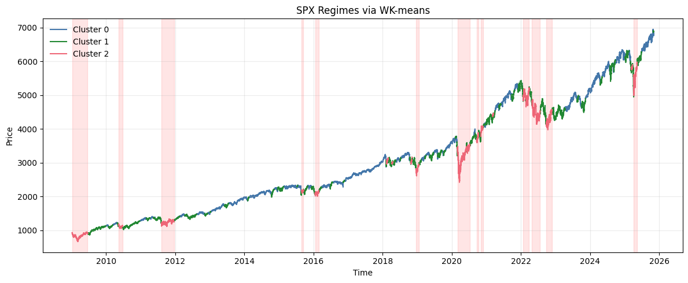
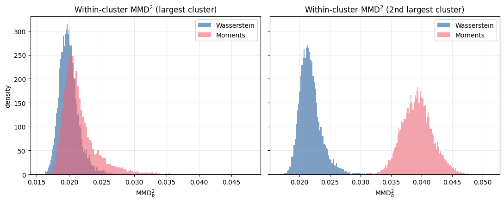
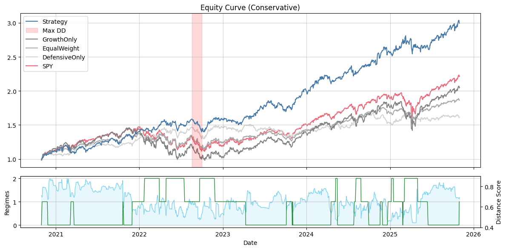

# Wasserstein Regime Clustering

Toolkit for regime detection on SPX intraday returns using Wasserstein K-means plus an illustrative growth/defensive rotation strategy. Code lives in `src/` while exploratory notebooks are in `jupyter/`.

## Repository Layout

```
├── src/
│   ├── clustering_methods.py       # Wasserstein & moment K-means utilities
│   ├── clustering_eval.py          # MMD calculator + clustering metrics
│   ├── jump_diffusion.py           # Merton jump-diffusion simulators + benchmark
│   ├── utils.py                    # segmentation, plotting, Yahoo helpers
│   ├── constants.py                # shared palette & globals
│   ├── performance_toolkit.py      # strategy analytics & visualization helpers
│   └── regime_trading_pipeline.py  # RegimeRotationStrategy & grid search
├── jupyter/
│   ├── clustering_examples.ipynb        # walkthrough of segmentation + clustering
│   ├── clustering_eval_examples.ipynb   # standalone evaluation notebook
│   ├── jump_diffusion_compare.ipynb     # jump-diffusion benchmark + visualization notebook
│   └── trading.ipynb                    # end-to-end strategy analysis & plots
├── documents/
│   ├── clustering_method.md        # auto-generated module docs
│   ├── clustering_eval.md
│   ├── jump_diffusion.md
│   ├── utils.md
│   └── regime_rotation.md
├── data/
│   ├── SPX_hourly.csv              # hourly SPX prices (signal driver)
│   ├── stocks.csv                  # cached Yahoo Finance closes
│   └── market_cap.csv              # derived market-cap time series
├── fig/
│   ├── spx_regimes.png             # WK-means regime overlay (used in README)
│   ├── mmd2_eval.png               # within-cluster MMD comparison figure
│   └── equity_curve.png            # strategy equity curve illustration
└── README.md
```

## Python Modules

### `src/utils.py`

- `segment_time_series(series, window, step)`: slices a pandas Series into overlapping windows and returns a Series with segment-end timestamps.
- `segment_stats`, `scatter_mean_variance`, `plot_regimes_over_price`: statistics/visualization helpers. Plots use a professional Tol palette (blue/red/green) and can highlight specific regimes (e.g., `plot_regimes_over_price(..., highlight_clusters=[0,2], highlight_min_width=5)`); regime legends are sorted numerically (Cluster 0, 1, 2, …) regardless of plotting order.
- `load_signal(signal_path, start_date=None, end_date=None)`: convenience parser for the semicolon-delimited SPX intraday CSV—builds a datetime index, computes returns, and clips to the requested window.
- `download_prices(tickers, start, end, field="Close")`: Yahoo! Finance downloader with csv caching and robust multi-index handling.
- `download_market_caps(tickers, start, end, prices=None)`: stitches shares outstanding histories (via `get_shares_full` cached under `data/share_counts_full.csv`) with the downloaded prices to form a market-cap time series used for weighting schemes.

### `src/clustering_methods.py`

- `WassersteinKMeans`: supports warm-starts (passing previous centroids) and accepts either a list of numpy arrays or a pandas Series of segments. `predict` returns a Series if given Series inputs, preserving timestamps.
- `MomentKMeans`: classic K-means on raw moments with k-means++ initialization.
- `HMMClustering`: Thin wrapper around `hmmlearn.GaussianHMM` to match previous clustering methods.

### `src/clustering_eval.py`

- `MMDCalculator`: RBF MMD implementation with between/within bootstrap routines and comparison plots used in the notebooks.
- `ClusteringMetrics`: Davies-Bouldin, Dunn, and (α-)silhouette metrics mirroring the evaluation section of the paper.

### `src/constants.py`

- `CLUSTER_PALETTE`: single source of truth for regime/cluster colors used across plotting utilities and notebooks. Import via `from src import CLUSTER_PALETTE` to keep figures consistent.

### `src/performance_toolkit.py`

- `RegimePerformanceToolkit`: wraps a `StrategyResult` and surfaces rich analytics (summary/regime tables, monthly heat maps, drawdown listings, regime transition probabilities, holding-period stats, etc.). Tables now emit percent-formatted returns/drawdowns for readability. Plot helpers cover `plot_equity_and_drawdown`, `plot_rolling_metrics`, `plot_weight_stack`, `plot_regime_performance`, and the combined `plot_correlation_and_transitions()` (return correlations + regime transition matrix) alongside other utilities. Instantiate it right after `strategy.backtest()` to explore diagnostics with a consistent API.

### `src/regime_trading_pipeline.py`

- `RegimeRotationStrategy`: class encapsulating signal preparation, rolling WK-means fitting (with hot start), daily return construction (calling the shared `download_prices`/`download_market_caps` helpers), and backtesting for a growth vs. defensive rotation. Supports both equal-weight and market-cap-weighted legs via the `weighting` argument. `StrategyResult` includes strategy curve plus benchmark curves (SPY + each leg/allocation under both schemes when available).
- `grid_search_regimes`: iterates across window/step/refit grids and reports metrics, with a `rich` progress bar.

### `src/jump_diffusion.py`

- `JumpDiffusionParams`: typed container for (μ, σ, λ, γ, δ).
- `MertonJumpDiffusion`: class with `simulate_path` and `log_return_moments(dt)` for single-regime paths.
- `RegimeSwitchingMerton`: bull/bear simulator with jittered regime windows (both change-point locations and optional per-window length perturbations via `length_jitter`). Call `simulate(...)` to reproduce Figure 9.
- `MertonBenchmark`: orchestrates repeated simulations + clustering (Wasserstein vs. Moments by default) to produce the accuracy table (Section 3.3.2). Call `run(return_details=True)` to also retrieve the simulated price path, segmented windows, true regimes, and per-algorithm label Series—handy for piping into `plot_regimes_over_price`, `scatter_mean_variance`, etc.
- Compatibility wrappers `simulate_merton_jump_diffusion` / `simulate_merton_jump_regimes` are provided for notebooks/scripts that previously imported them from `utils`.

## Notebooks (`jupyter/`)

- **`clustering_examples.ipynb`** – walkthrough of segmenting SPX returns, fitting Wasserstein vs. moment K-means, visualizing regimes, and comparing clustering quality via MMD.
- **`clustering_eval_examples.ipynb`** – dedicated evaluation notebook showing how to run `ClusteringMetrics`/MMD comparisons (Davies–Bouldin, Dunn, silhouette, bootstrapped MMD) on WK-means vs. moment K-means outputs.
- **`jump_diffusion_compare.ipynb`** – generates the synthetic Merton benchmark table via `MertonBenchmark.run(return_details=True)` and pipes the stored price/segment/prediction Series into `plot_regimes_over_price` and `scatter_mean_variance` to contrast the true regimes with Wasserstein vs. Moment assignments.
- **`trading.ipynb`** – uses `RegimeRotationStrategy` to fit regimes, run backtests with different allocation maps, plot equity curves (with drawdown highlights) and generate figures for reporting.

## Examples

**WK-means regimes on SPX (2008–2025).** Hourly SPX closes are segmented into 15-trading-day windows (step 12 hours) and fed to `WassersteinKMeans(n_clusters=3, p_dim=1)` trained on 2008‑12‑11 through 2025‑10‑31. Cluster 2 (pink) flags high-volatility selloffs (GFC, COVID crash, 2022 tightening) while Clusters 0/1 capture expansionary and transition regimes. The plot comes from `plot_regimes_over_price(..., highlight_clusters=[2], highlight_min_width=300)`. [Source: `clustering_examples.ipynb`](jupyter/clustering_examples.ipynb)

<p align="center">
  
</p>

**Within-cluster MMD² comparison for SPX clustering.** Bootstrapped maximum mean discrepancy estimates for the two largest clusters when fitting Wasserstein vs. moment K-means on the same SPX segments. Wasserstein clusters show tighter within-cluster homogeneity (left panel) and better separation in the second-largest cluster (right panel). [Source: `clustering_eval_examples.ipynb`](jupyter/clustering_eval_examples.ipynb)

<p align="center">
  
</p>

**Merton Jump Diffusion benchmark accuracy vs. runtime (50 runs, seed 42).** `MertonBenchmark` comparing Wasserstein K-means, Moment K-means, and an HMM baseline using window grids `{ "Wasserstein": (72, 12), "Moment": (360, 6) }`. Each run draws alternating bull/bear regimes and simulates the valuation path via `RegimeSwitchingMerton`, i.e., geometric Brownian motion with drift/volatility $(\mu_i, \sigma_i)$ plus Poisson jump arrivals $\lambda_i$ whose jump sizes follow Normal $(\gamma_i, \delta_i)$ inside each regime. Metrics report mean ± std for total accuracy and conditioned on the true regime, along with per-run wall-clock time. [Source: `jump_diffusion_compare.ipynb`](jupyter/jump_diffusion_compare.ipynb)

<p align="center">

| Algorithm   |              Total |          Regime-on |         Regime-off |           Runtime |
| ----------- | -----------------: | -----------------: | -----------------: | ----------------: |
| Wasserstein | **94.14% ± 4.89%** | **90.20% ± 7.15%** |     95.48% ± 5.35% |     0.75s ± 0.06s |
| Moment      |     79.43% ± 1.17% |     19.84% ± 4.41% | **99.63% ± 0.11%** | **0.15s ± 0.00s** |
| HMM         |     65.25% ± 6.96% |     39.40% ± 7.49% |     74.31% ± 9.07% |     0.25s ± 0.00s |

</p>

**Rotation strategy equity curve (Oct 2020–Oct 2025).** `RegimeRotationStrategy` re-fits WK-means every 24 trading days on rolling 360 hours (15 days) windows, then allocates between a growth basket (NFLX, LULU, COST) and defensive basket (KO, PG, JNJ) using equal weights. The top panel benchmarks the regime-aware allocation against SPY and static growth/defensive portfolios, highlighting max drawdown in red; the lower strip shows the predicted regimes (0 = calm growth, 1 = transition, 2 = defensive) that drive allocation switches. [Source: `trading.ipynb`](jupyter/trading.ipynb)

<p align="center">
  
</p>

**Backtest summary statistics.** Same run as the equity-curve figure, summarizing cumulative/annual returns, annualized volatility, Sharpe, and max drawdown for each sleeve.

<p align="center">

| Portfolio     | cumulative_return | annual_return | annual_volatility |    sharpe | max_drawdown |
| ------------- | ----------------: | ------------: | ----------------: | --------: | -----------: |
| Strategy      |         **1.822** |     **0.231** |             0.147 | **1.578** |   **-0.119** |
| GrowthOnly    |             0.937 |         0.142 |             0.208 |     0.683 |       -0.324 |
| EqualWeight   |             0.810 |         0.126 |             0.141 |     0.897 |       -0.170 |
| DefensiveOnly |             0.616 |         0.101 |         **0.122** |     0.830 |       -0.126 |
| SPY           |             1.233 |         0.175 |             0.172 |     1.020 |       -0.245 |

</p>

## Usage

1. Install dependencies:
   ```bash
   pip3 install -r requirements.txt  # ensure pandas, numpy, matplotlib, rich, yfinance
   ```
2. Place `SPX_hourly.csv` in `data/` (hourly SPX prices separated by semicolons).
3. Run the pipeline:

   ```bash
   python3 -m src.regime_trading_pipeline
   ```

   or import `RegimeRotationStrategy` inside notebooks/scripts.

4. Optional hyper-parameter tuning:
   ```python
   from src.regime_trading_pipeline import grid_search_regimes
   grid = grid_search_regimes(growth, defensive, windows=(240, 300), steps=(6, 12), refits=(24, 48))
   print(grid.head())
   ```

5. Analyze performance/plots programmatically:

   ```python
   from src.performance_toolkit import RegimePerformanceToolkit

   toolkit = RegimePerformanceToolkit(result)
   print(toolkit.summary_table()[["cumulative_return", "annual_return", "sharpe", "max_drawdown"]])
   toolkit.plot_equity_and_drawdown()
   toolkit.plot_rolling_metrics(window=63)
   ```

## Documentation

Auto-generated markdown files reside in `documents/` summarizing each module (`clusterings.md`, `utils.md`, `MMD.md`, `regime_rotation.md`).

Feel free to explore the notebooks for visual examples and adapt the strategy class to your own baskets of tickers.
